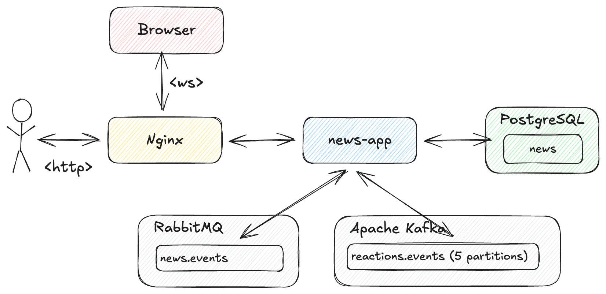

# spring-boot-nginx-websocket-rabbitmq-kafka

[](LICENSE)
[](https://buymeacoffee.com/ivan.franchin)

This project shows how to implement an interactive news broadcasting app. A user can post news using a REST API, and it gets sent out to users instantly through a live `WebSocket` connection. Users can react by liking or disliking the news, and the app keeps track of all those reactions to show the total likes and dislikes.

## Proof-of-Concepts & Articles

On [ivangfr.github.io](https://ivangfr.github.io), I have compiled my Proof-of-Concepts (PoCs) and articles. You can easily search for the technology you are interested in by using the filter. Who knows, perhaps I have already implemented a PoC or written an article about what you are looking for.

## Additional Readings

- \[**Medium**\] [**Implementing an Interactive and Scalable News Broadcasting App**](https://medium.com/@ivangfr/implementing-an-interactive-and-scalable-news-broadcasting-app-333aa06ee2cd)

## Application

- ### news-app

  [`Spring Boot`](https://docs.spring.io/spring-boot/index.html) Java web app that provides a REST endpoint for publishing and broadcasting news. It also supports real-time broadcasting and user reactions through full-duplex [`WebSocket`](https://developer.mozilla.org/en-US/docs/Web/API/WebSockets_API) channels. The app stores data in [`PostgreSQL`](https://www.postgresql.org/) and runs behind a [`Nginx`](https://nginx.org/index.html) load balancer. For broadcasting, it connects to [`RabbitMQ`](https://www.rabbitmq.com/), and user reactions are handled sequentially and partitioned by news ID using an [`Apache Kafka`](https://kafka.apache.org/) topic partition.

  It has the following endpoints:
  ```
   GET /api/news
   GET /api/news/{id}
  POST /api/news {"description": "..."}
   GET /actuator/health
  ```

## Project Diagram



## Architecture

This app uses an **event-driven architecture** with four main components:

- **Client (Browser)** — connects via WebSocket for real-time updates and reactions
- **Nginx** — load balancer distributing traffic across Spring Boot instances
- **Spring Boot** — REST API for publishing news, WebSocket for broadcasting
- **PostgreSQL** — stores news and reaction counts
- **RabbitMQ** — broadcasts news to all clients in real-time
- **Kafka** — processes reactions sequentially, partitioned by news ID

**Data Flow:**
- `POST /api/news` → saves to PostgreSQL → broadcasts via RabbitMQ → WebSocket clients receive it
- Client reaction (via WebSocket) → sent to Kafka → processed in order → saved to PostgreSQL

For a detailed explanation, check out the [**Medium article**](https://medium.com/@ivangfr/implementing-an-interactive-and-scalable-news-broadcasting-app-333aa06ee2cd).

## Prerequisites

- [`Java 25`](https://www.oracle.com/java/technologies/downloads/#java25) or higher;
- A containerization tool (e.g., [`Docker`](https://www.docker.com), [`Podman`](https://podman.io), etc.)
- [`Bash 4.0`](https://www.gnu.org/software/bash/) or higher (macOS ships with Bash 3.2; install via `brew install bash`)

## Build News App Docker Image

Open a terminal and, inside the `spring-boot-nginx-websocket-rabbitmq-kafka` root folder, run the following script:
```bash
./build-docker-images.sh
```

## Configure /etc/hosts

Add the following line to `/etc/hosts`
```text
127.0.0.1 news-app.lb
```

## Start Docker Compose services

In a terminal and inside the `spring-boot-nginx-websocket-rabbitmq-kafka` root folder run:
```bash
podman compose up -d
```

## Simulation

- Open one or more browsers and access:
  ```
  http://news-app.lb
  ```

- In a terminal, publish a news:

  - Informing the news description:
    ```bash
    curl -X POST http://news-app.lb/api/news \
      -H "Content-Type: application/json" \
      -d '{"description": "This is the content of the breaking news."}'
    ```
  
  - Not informing the news description. In this case, a random description will be generated:
    ```bash
    curl -X POST http://news-app.lb/api/news
    ```

- You should see the news being displayed in the browsers opened before.

- You can react to the news by clicking on the "Like" or "Dislike" buttons.

- You can check the news statistic by executing the following command in a terminal:
  ```bash
  curl http://news-app.lb/api/news/{id}
  ```
  > **Note**: Replace `{id}` with the actual news id returned when publishing the news.

## Demo


## Useful Commands

- **Nginx**

  If you wish to modify the `Nginx` configuration file without restarting its Docker container, follow these steps:

    - Apply the changes in the `nginx/nginx.conf` file;
    - Execute the following command to access the `nginx` Docker container:
      ```bash
      docker exec -it nginx bash
      ```
    - In the `nginx` Docker container terminal, run:
      ```bash
      nginx -s reload
      ```
    - To exit, just run the command `exit`.

- **PostgreSQL**

  - Execute the following command to access the `psql` terminal:
    ```bash
    docker exec -it postgres psql -U postgres -d newsdb
    ```
  - In the terminal, we can select all news records by running:
    ```sql
    select * from news;
    ```
  - To exit, just run the command `\q`.

- **Kafdrop**

  `Kafdrop` can be accessed at http://localhost:9000

- **RabbitMQ UI**

  `RabbitMQ UI` can be accessed at http://localhost:15672 (`guest` for _username_ and _password_)

## Shutdown

To stop and remove Docker Compose containers, network, and volumes, go to a terminal and, inside the `spring-boot-nginx-websocket-rabbitmq-kafka` root folder, run the following command:
```bash
podman compose down -v
```

## Cleanup

- To remove the Docker images created by this project, go to a terminal and, inside the `spring-boot-nginx-websocket-rabbitmq-kafka` root folder, run the script below:
  ```bash
  ./remove-docker-images.sh
  ```

- Remove the line below from `/etc/hosts`:
  ```text
  127.0.0.1 news-app.lb
  ```

## Startup Benchmarking

This project includes tools to benchmark and compare different Spring Boot optimization techniques.

> **Prerequisite**: Start the required Docker Compose services:
> ```bash
> podman compose up -d zookeeper kafka rabbitmq postgres
> ```

### Scripts

- **`collect-metrics.sh`** — Starts the app and measures RSS memory, CPU time, startup time (via "Started" log), and time to ready (via `/actuator/health` returning HTTP 200).
  ```bash
  export JAVA_JAR_COMMAND="java -jar news-app/target/news-app-1.0.0.jar"
  ./collect-metrics.sh
  ```

- **`benchmark.sh`** — Runs automated benchmarks comparing 5 configurations. Outputs a CSV file.
  ```bash
  ./benchmark.sh 3  # 3 runs per configuration
  ```

- **`benchmark-viewer.html`** — HTML viewer with charts to visualize CSV results. Open in a browser.

- **`manual-steps.md`** — Reference guide with manual commands for each configuration.

### Configurations Tested

| Configuration | Description |
|---------------|-------------|
| Uber JAR | Standard executable JAR |
| Extracted executable JAR | Self-extracting JAR |
| CDS | Class Data Sharing |
| AOT Cache | JVM Ahead-of-Time Cache |
| AOT Cache + Spring Boot AOT | JVM AOT + Spring Boot AOT |

## How to optimize GIFs and PNGs in documentation folder

\[**Medium**\] [**How I Reduce GIF and Screenshot Sizes for My Technical Articles on macOS**](https://medium.com/itnext/how-i-reduce-gif-and-screenshot-sizes-for-my-technical-articles-on-macos-7fea331afc68)

## Support

If you find this useful, consider buying me a coffee:

<a href="https://buymeacoffee.com/ivan.franchin"></a>

## License

This project is licensed under the [MIT License](./LICENSE).
